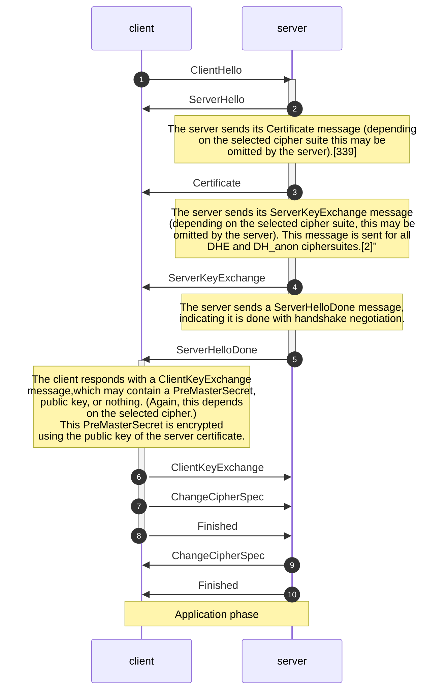

This is just a test README to try out integrated Mermaid sequence charts and other diagrams.

Here's a TLS handshake sequence diagram with some notes.

```mermaid
sequenceDiagram
    autonumber
    participant client
    participant server

    client ->> server: ClientHello

    activate server
    server ->> client: ServerHello

    note over server: The server sends its Certificate message (depending<br/>on the selected cipher suite this may be<br/>omitted by the server).[339]
    server ->> client: Certificate

    note over server: The server sends its ServerKeyExchange message<br/>(depending on the selected cipher suite, this may be<br/> omitted by the server). This message is sent for all<br/>DHE and DH_anon ciphersuites.[2]"
    server ->> client: ServerKeyExchange

    note over server: The server sends a ServerHelloDone message,<br/>indicating it is done with handshake negotiation.
    server ->> client: ServerHelloDone
    deactivate server

    activate client
    note over client: The client responds with a ClientKeyExchange<br/>message,which may contain a PreMasterSecret,<br/>public key, or nothing. (Again, this depends<br/> on the selected cipher.)<br/>This PreMasterSecret is encrypted<br/>using the public key of the server certificate.
    client ->> server: ClientKeyExchange
    client ->> server: ChangeCipherSpec
    client ->> server: Finished
    deactivate client

    server ->> client: ChangeCipherSpec
    server ->> client: Finished

   note over client, server: Application phase
```
